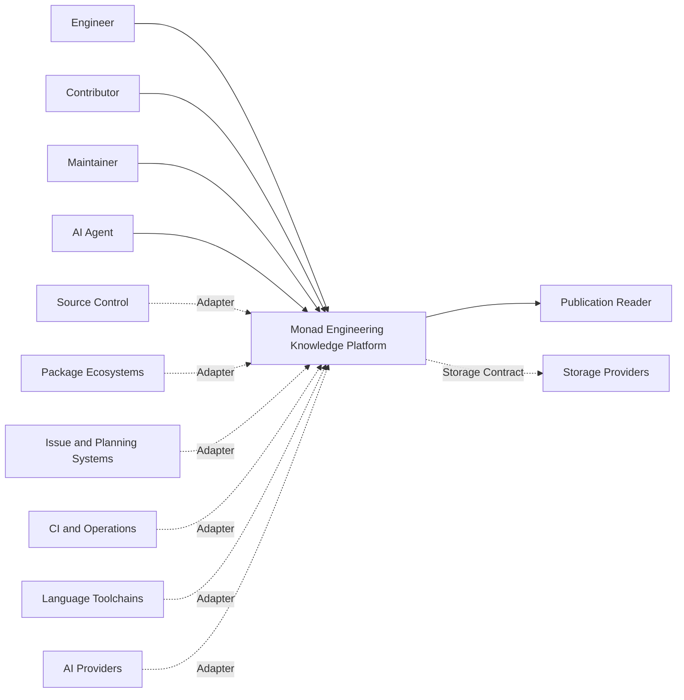
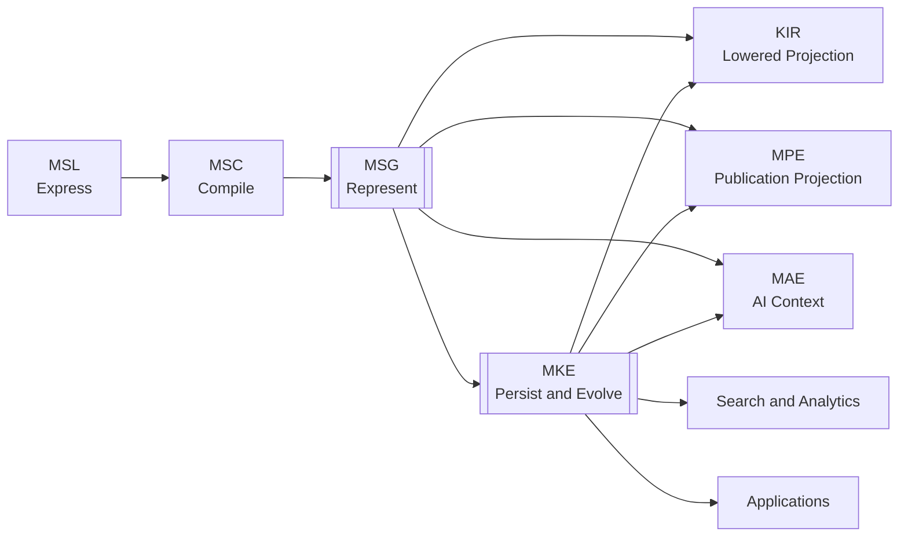
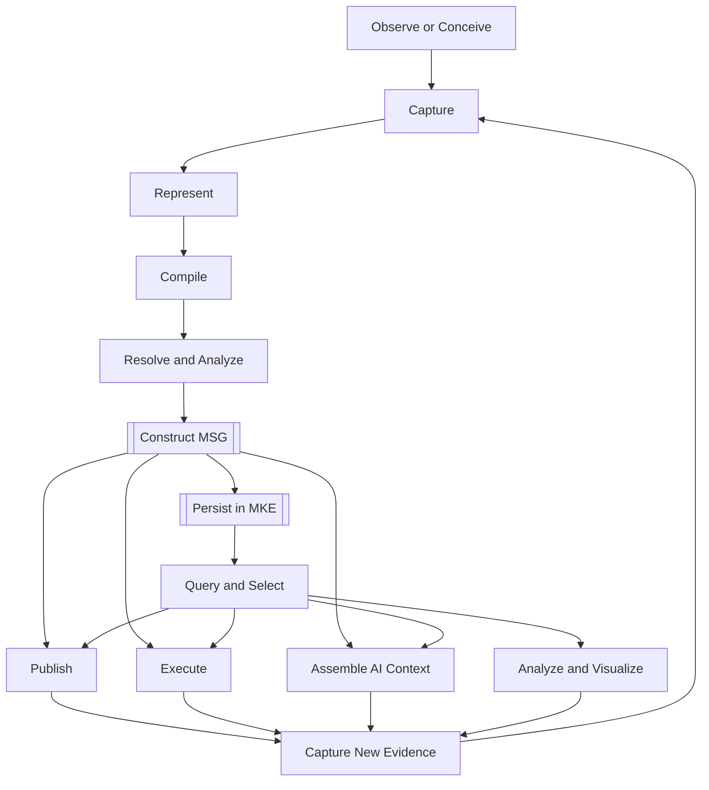
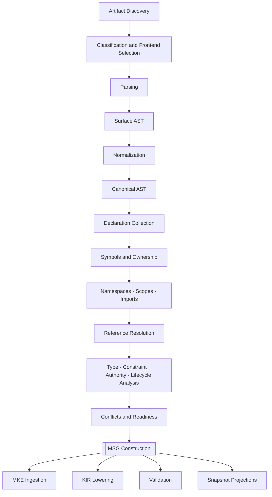
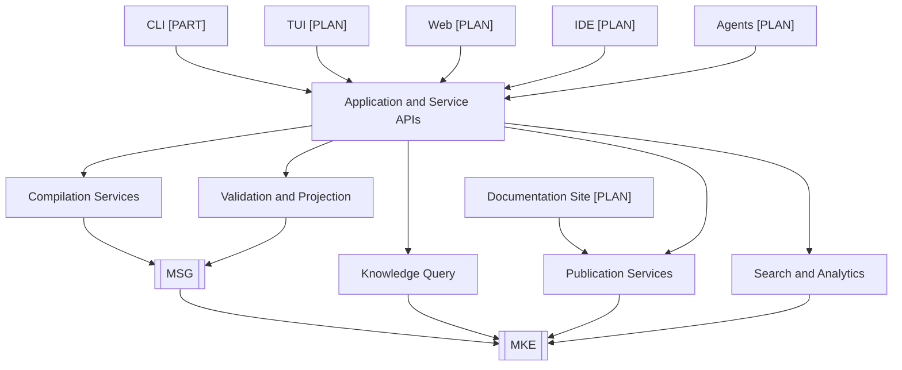
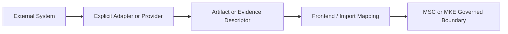
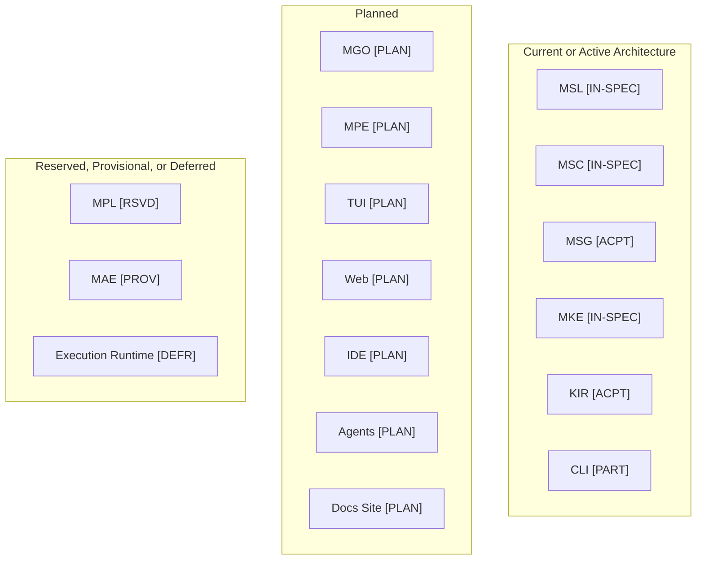
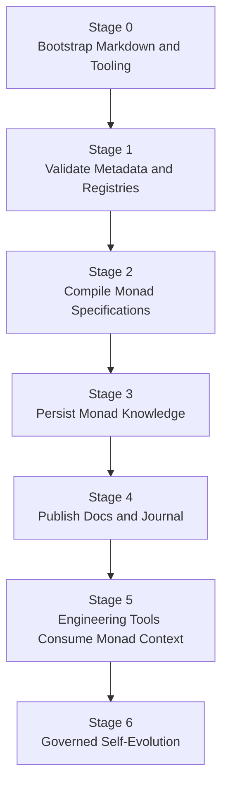

---

artifact:
id: MONAD-VISION-ARCHITECTURE-MAP
type: vision.architecture-map
namespace: monad

metadata:
title: Monad Architecture Map
version: 0.1.0
status: draft
created: 2026-08-06
authors:
- Monad Architecture Team
tags:
- vision
- architecture
- architecture-map
- layers
- boundaries
- dependencies
- diagrams

relationships:
depends_on:
- MONAD-VISION-MANIFESTO
- MONAD-VISION-PRINCIPLES
- MONAD-VISION-LAWS
- MONAD-VISION-GLOSSARY
- MONAD-VISION-ECOSYSTEM
enables:
- MONAD-VISION-COMPILER-PIPELINE
- MONAD-VISION-KNOWLEDGE-LIFECYCLE
- MONAD-VISION-CONSTITUTION
- MSC-CORE-0008
- MONAD-DOCS-ARCHITECTURE
-------------------------

# Monad Architecture Map

## 1. Purpose

This document is the canonical high-level map of the Monad ecosystem.

It presents the system through several complementary views:

* system context;
* architectural layers;
* subsystem responsibilities;
* dependency direction;
* knowledge flow;
* compiler representations;
* persistence boundaries;
* projection boundaries;
* repository knowledge domains;
* application access;
* external integrations;
* subsystem maturity;
* self-hosting progression.

The map is intended to help contributors understand Monad's overall structure before reading detailed architectural decision records or specifications.

This document is explanatory rather than independently normative.

If this map conflicts with an accepted ADR or normative specification, the accepted ADR or specification governs. The discrepancy must then be corrected here.

---

# 2. Monad in One Sentence

> Monad is an engineering knowledge compilation platform that transforms human and machine engineering information into canonical semantic graphs from which publication, execution, AI context, validation, analytics, and other engineering artifacts may be derived.

The compact architectural model is:

```text
Capture
  ↓
Compile
  ↓
Understand
  ↓
Persist
  ↓
Project
  ↓
Apply
  ↓
Learn
```

---

# 3. Reading This Map

## 3.1 Architectural Direction

Unless otherwise noted, architectural dependencies flow downward:

```text
Vision and Governance
        ↓
Knowledge Foundations
        ↓
Languages and Capture
        ↓
Compilation
        ↓
Semantic Representation
        ↓
Knowledge Kernel
        ↓
Services and Projections
        ↓
Applications and Experiences
```

A lower layer may implement contracts established by a higher foundational layer.

A foundational layer must not depend on presentation-layer details.

---

## 3.2 Arrow Conventions

| Notation     | Meaning                                            |
| ------------ | -------------------------------------------------- |
| `A → B`      | A directly supplies, invokes, or produces B        |
| `A ⇢ B`      | A integrates with B through an explicit adapter    |
| `A ⤳ B`      | B is a projection or derived representation of A   |
| `A ⊣ B`      | A governs, constrains, or defines rules for B      |
| `A ↔ B`      | Explicit bidirectional exchange; must be justified |
| `A --x--> B` | Dependency or transformation is prohibited         |

Arrows must not be interpreted as ownership unless ownership is explicitly stated.

---

## 3.3 Boundary Conventions

| Boundary                    | Meaning                                                               |
| --------------------------- | --------------------------------------------------------------------- |
| Accepted subsystem          | Architecturally accepted responsibility                               |
| Planned subsystem           | Accepted direction without completed detailed specification           |
| Provisional subsystem       | Working architectural concept subject to refinement                   |
| External system             | Outside the Monad architectural boundary                              |
| Canonical semantic boundary | A boundary across which canonical meaning is established or persisted |
| Projection boundary         | A boundary across which derived views are produced                    |

---

## 3.4 Maturity Markers

```text
[IMPL]     Implemented
[PART]     Partially implemented
[SPEC]     Specified
[IN-SPEC]  In specification
[ACPT]     Architecturally accepted
[PLAN]     Planned
[PROV]     Provisional
[RSVD]     Reserved
[DEFR]     Deferred
```

Maturity describes current project state.

It does not describe architectural importance.

---

# 4. System Context

Monad sits between engineering knowledge sources and the people or systems that consume engineering understanding.

```text
┌──────────────────────────── EXTERNAL KNOWLEDGE SOURCES ────────────────────────────┐
│                                                                                    │
│  Source Repositories    Package Ecosystems    Issue Trackers    CI / Operations    │
│  Documents              Schemas               Research          Runtime Evidence    │
│  Human Decisions        Existing Code         External Tools    AI Outputs           │
│                                                                                    │
└───────────────────────────────────┬────────────────────────────────────────────────┘
                                    │ explicit adapters, languages, or frontends
                                    ▼
┌──────────────────────────────────── MONAD ─────────────────────────────────────────┐
│                                                                                    │
│  Capture → Compilation → Semantic Graph → Knowledge Engine → Services/Projections  │
│                                                                                    │
└───────────────────────────────────┬────────────────────────────────────────────────┘
                                    │
                                    ▼
┌────────────────────────────── KNOWLEDGE CONSUMERS ─────────────────────────────────┐
│                                                                                    │
│  Engineers       Maintainers       Contributors       AI Agents                    │
│  Documentation Readers             External Automation                              │
│  CLI / TUI / Web / IDE Users       Publication Audiences                            │
│                                                                                    │
└────────────────────────────────────────────────────────────────────────────────────┘
```

Monad does not assume external information is already semantically coherent.

Every integration must declare:

* source identity;
* representation;
* version;
* provenance;
* semantic support;
* normalization behavior;
* authority;
* loss or uncertainty.

---

## 4.1 System-Context Diagram



External providers are integrations, not architectural authorities.

---

# 5. Layered Architecture

```text
┌────────────────────────────────────────────────────────────────────────────┐
│ LAYER 0 — VISION AND GOVERNANCE                                            │
│ Manifesto · Principles · Laws · Glossary · Constitution · ADRs             │
│ Responsibility: preserve architectural purpose and coherence               │
├────────────────────────────────────────────────────────────────────────────┤
│ LAYER 1 — KNOWLEDGE FOUNDATIONS                                            │
│ Artifact · Identity · Provenance · Authority · Lifecycle · Evidence · MGO  │
│ Responsibility: define shared semantic foundations                         │
├────────────────────────────────────────────────────────────────────────────┤
│ LAYER 2 — LANGUAGES AND CAPTURE                                            │
│ MSL · MPL [RSVD] · Adapters · Frontends · Authoring Interfaces             │
│ Responsibility: express or import engineering knowledge                    │
├────────────────────────────────────────────────────────────────────────────┤
│ LAYER 3 — COMPILATION                                                      │
│ MSC · Parsing · Normalization · Binding · Resolution · Semantic Analysis    │
│ Responsibility: compile supported artifacts into analyzed semantics        │
├────────────────────────────────────────────────────────────────────────────┤
│ LAYER 4 — SEMANTIC REPRESENTATION                                          │
│ MSG · Semantic Facts · Conflicts · Evidence Links · Compilation Snapshot    │
│ Responsibility: represent one compiled semantic knowledge snapshot         │
├────────────────────────────────────────────────────────────────────────────┤
│ LAYER 5 — KNOWLEDGE KERNEL                                                 │
│ MKE · Persistence · History · Versioning · Indexing · Query · Evolution     │
│ Responsibility: preserve and evolve semantic knowledge over time           │
├────────────────────────────────────────────────────────────────────────────┤
│ LAYER 6 — KNOWLEDGE SERVICES AND PROJECTIONS                               │
│ MPE [PLAN] · MAE [PROV] · KIR · Search · Analytics · Validation · Backends │
│ Responsibility: derive purpose-specific knowledge products and services    │
├────────────────────────────────────────────────────────────────────────────┤
│ LAYER 7 — APPLICATIONS AND EXPERIENCES                                     │
│ CLI · TUI · Web · IDE · Agents · Documentation Site · APIs                 │
│ Responsibility: provide human and system access to Monad                    │
└────────────────────────────────────────────────────────────────────────────┘
```

---

## 5.1 Layered Ecosystem Diagram

```mermaid
flowchart TB
    subgraph L0["Layer 0 — Vision and Governance"]
        Vision["Manifesto · Principles · Laws · Glossary"]
        Governance["Constitution · ADRs"]
    end

    subgraph L1["Layer 1 — Knowledge Foundations"]
        Foundations["Artifacts · Identity · Provenance"]
        GovernanceModels["Authority · Lifecycle · Evidence"]
        MGO["MGO [PLAN]"]
    end

    subgraph L2["Layer 2 — Languages and Capture"]
        MSL["MSL [IN-SPEC]"]
        MPL["MPL [RSVD]"]
        Adapters["Adapters · Frontends · Authoring"]
    end

    subgraph L3["Layer 3 — Compilation"]
        MSC["MSC [IN-SPEC]"]
        Passes["Parsing · Normalization · Binding · Resolution · Analysis"]
    end

    subgraph L4["Layer 4 — Semantic Representation"]
        MSG["MSG [ACPT]"]
        SemanticState["Facts · Conflicts · Evidence · Readiness"]
    end

    subgraph L5["Layer 5 — Knowledge Kernel"]
        MKE["MKE [IN-SPEC]"]
        KernelServices["Persistence · Versioning · Indexing · Query · Evolution"]
    end

    subgraph L6["Layer 6 — Services and Projections"]
        MPE["MPE [PLAN]"]
        MAE["MAE [PROV]"]
        KIR["KIR [ACPT]"]
        OtherServices["Search · Analytics · Validation · Backends"]
    end

    subgraph L7["Layer 7 — Applications and Experiences"]
        Apps["CLI · TUI · Web · IDE · Agents · Docs · APIs"]
    end

    L0 --> L1
    L1 --> L2
    L2 --> L3
    L3 --> L4
    L4 --> L5
    L5 --> L6
    L6 --> L7
```



This diagram shows primary architectural placement, not every legal runtime interaction.

---

# 6. Core Dependency Map

The core knowledge-compilation spine is:

```text
MSL
 │ expresses
 ▼
MSC
 │ compiles
 ▼
MSG
 │ represents one semantic snapshot
 ▼
MKE
   persists, versions, indexes, queries, and evolves
```

The primary derived paths are:

```text
MSG and MKE
    │
    ├──⤳ KIR and backend-oriented representations
    │
    ├──⤳ MPE publication models and rendered publications
    │
    ├──⤳ MAE semantic context and assisted reasoning
    │
    ├──⤳ Search, analytics, reports, and visualizations
    │
    └──→ Applications and integration APIs
```

MKE is not required to construct an in-memory MSG during every compilation.

A valid compilation may produce MSG before or without persistent ingestion.

---

## 6.1 Core Dependency Diagram



---

# 7. Canonical Component Inventory

| Component          |        Layer | Maturity                        | Primary Responsibility                                       |
| ------------------ | -----------: | ------------------------------- | ------------------------------------------------------------ |
| Vision artifacts   |            0 | Draft/Accepted by artifact      | Establish purpose, philosophy, vocabulary, and governance    |
| ADR system         |            0 | Implemented as artifacts        | Record significant architectural decisions                   |
| Artifact model     |            1 | In specification                | Define identifiable engineering artifacts                    |
| Identity model     |            1 | In specification                | Define stable semantic and artifact identity                 |
| Provenance model   |            1 | In specification                | Preserve origin and transformation lineage                   |
| Authority model    |            1 | In specification                | Define semantic standing and adoption                        |
| Lifecycle model    |            1 | In specification                | Define evolution and applicability over time                 |
| MGO                |            1 | Planned                         | Define foundational graph vocabulary                         |
| MSL                |            2 | In specification                | Express engineering knowledge and intent                     |
| MPL                |            2 | Reserved                        | Express publication structure and intent                     |
| Import adapters    | 2/3 boundary | Planned                         | Convert supported external artifacts into compiler inputs    |
| MSC                |            3 | In specification                | Compile supported artifacts into analyzed semantic graphs    |
| MSG                |            4 | Accepted                        | Represent one compiled semantic knowledge snapshot           |
| MKE                |            5 | In specification                | Persist, version, index, query, govern, and evolve knowledge |
| KIR                |            6 | Accepted term                   | Represent lowered target-oriented projections                |
| MPE                |            6 | Planned                         | Produce human-facing publication projections                 |
| MAE                |            6 | Provisional                     | Assemble semantic context and support AI-assisted reasoning  |
| Search/analytics   |            6 | Planned                         | Query and analyze semantic knowledge                         |
| CLI                |            7 | Partially implemented/bootstrap | Provide scriptable local interaction                         |
| TUI                |            7 | Planned                         | Provide interactive terminal workflows                       |
| Web                |            7 | Planned                         | Provide visual knowledge interaction                         |
| IDE integration    |            7 | Planned                         | Bring semantic context into editing workflows                |
| Documentation site |            7 | Planned                         | Publish human-facing documentation projections               |
| Agents             |            7 | Planned                         | Perform governed work using semantic context                 |
| APIs               |            7 | Planned                         | Expose compilation, query, and projection capabilities       |

---

# 8. Responsibility Boundaries

## 8.1 Canonical Responsibility Matrix

| Component    | Owns                                      | Must Not Own                                         |
| ------------ | ----------------------------------------- | ---------------------------------------------------- |
| MSL          | Expression of engineering knowledge       | Compilation, historical persistence                  |
| MSC          | Compilation and semantic construction     | Persistent historical storage, publication ownership |
| MSG          | One compiled semantic snapshot            | Parsing, storage-product implementation              |
| MKE          | Persistent semantic knowledge and history | Source-language semantics and parsing                |
| MGO          | Foundational semantic vocabulary          | One repository's graph state                         |
| MPL          | Publication intent                        | Concrete rendering                                   |
| MPE          | Publication assembly and rendering        | Canonical semantic meaning                           |
| MAE          | AI context and assisted reasoning         | Automatic authority promotion                        |
| KIR          | Lowered target-oriented representations   | Canonical semantic truth                             |
| Applications | User and integration experiences          | Foundational ontology and semantic rules             |

---

## 8.2 Responsibility Diagram

```text
MSL   describes
MSC   compiles
MSG   represents
MKE   persists and evolves
MGO   defines vocabulary
MPL   describes publication intent
MPE   publishes
MAE   assembles AI context and assists reasoning
KIR   lowers for targets
Apps  interact
```

No component should require a paragraph of unrelated verbs to justify its existence.

---

# 9. Canonical Representation Map

Monad maintains explicit boundaries among source, compiler, semantic, persistent, lowered, and published representations.

```text
SOURCE REPRESENTATIONS
Markdown · YAML · Code · Schemas · ADRs · Work Packets · External Artifacts
        │
        ▼
SURFACE AST
Source-language structure
        │
        ▼
CANONICAL AST
Normalized shared compiler structure
        │
        ▼
DECLARATION AND SYMBOL STATE
Declarations · Symbols · Ownership · Scopes · Imports
        │
        ▼
RESOLUTION AND ANALYSIS STATE
References · Types · Constraints · Authority · Lifecycle · Conflicts
        │
        ▼
════════════════ CANONICAL SEMANTIC BOUNDARY ════════════════
        │
        ▼
MSG
One compiled semantic knowledge snapshot
        │
        ├───────────────┐
        ▼               ▼
MKE                 Direct projections
Persistent          from current snapshot
knowledge history
        │               │
        └───────┬───────┘
                ▼
        DERIVED REPRESENTATIONS
KIR · Publications · AI Context · Search Views · Analytics · Reports
                │
                ▼
        APPLICATION EXPERIENCES
CLI · TUI · Web · IDE · Agents · Documentation Site · APIs
```

---

## 9.1 Representation Comparison

| Representation             | Purpose                                          |      Canonical Meaning? | Persistent by Definition? |
| -------------------------- | ------------------------------------------------ | ----------------------: | ------------------------: |
| Source artifact            | Authoring or import                              |                      No |        Artifact-dependent |
| Surface AST                | Preserve source-language structure               |                      No |                        No |
| Canonical AST              | Shared normalized compiler structure             |                      No |                        No |
| Symbol table               | Compiler binding and lookup                      |                      No |                        No |
| Reference graph            | Compiler resolution state                        |                      No |                        No |
| Semantic-analysis snapshot | Compiler analysis results                        |     Not final by itself |                        No |
| MSG                        | Canonical semantics for one compilation snapshot |                     Yes |                        No |
| MKE knowledge state        | Persistent history of semantic knowledge         | Yes, for stored history |                       Yes |
| KIR                        | Lowered target-oriented representation           |                      No |                  Optional |
| Publication projection     | Human-facing view                                |                      No |                  Optional |
| AI context                 | Purpose-specific model context                   |                      No |         Usually transient |
| Application view           | Interaction-oriented presentation                |                      No |         Usually transient |

---

# 10. Compiler-to-Kernel Boundary

The compiler/kernel boundary is the transition from compiled semantic state to persistent knowledge.

```text
MSC
  │
  │ constructs and validates
  ▼
MSG
  │
  │ optional persistence operation
  ▼
MKE
```

## MSC Owns

* discovery;
* parsing;
* normalization;
* declaration collection;
* symbol binding;
* namespace and reference resolution;
* type analysis;
* constraint analysis;
* authority and lifecycle analysis;
* compatibility analysis;
* semantic conflict construction;
* MSG construction;
* compiler diagnostics;
* deterministic snapshots.

## MKE Owns

* durable storage;
* graph versioning;
* historical knowledge;
* semantic indexing;
* query;
* lineage across snapshots;
* knowledge evolution;
* persistent lifecycle records;
* persistent authority transitions;
* graph migrations;
* long-term evidence relationships.

## Boundary Rules

1. MSC may construct MSG without MKE.
2. MKE ingests accepted MSG through a declared contract.
3. Storage failure does not redefine the semantic meaning of a successfully constructed MSG.
4. MKE must not silently alter ingested semantic meaning.
5. MKE-derived information must identify whether it is stored fact, computed view, inference, or projection.
6. A later MKE query result does not mutate an earlier compiler snapshot.
7. Semantic migrations must remain explicit and versioned.
8. Persistent identifiers must preserve correspondence with semantic identities.

---

# 11. Projection Boundary

Everything downstream of canonical semantic knowledge is a projection unless it introduces new captured evidence through an explicit process.

```text
MSG / MKE
    │
    ├──⤳ Documentation
    ├──⤳ Engineering Journal
    ├──⤳ Website
    ├──⤳ Books and Presentations
    ├──⤳ KIR and Generated Code
    ├──⤳ Validation and Execution Plans
    ├──⤳ AI Context
    ├──⤳ Search Results
    ├──⤳ Analytics
    └──⤳ Reports and Dashboards
```

## Projection Rules

1. A projection must identify its semantic source.
2. A projection must identify its transformation or renderer.
3. Lossy projections must identify lost or omitted semantics.
4. A projection must not silently strengthen authority.
5. A publication must not become canonical merely because users read it.
6. Generated code does not redefine its source specification automatically.
7. AI summaries remain derived context.
8. Runtime observations may become new evidence only through explicit capture and compilation.
9. Corrections should update canonical knowledge, then regenerate projections.
10. Manual projection edits must be either prohibited, preserved as overlays, or re-ingested explicitly.

---

# 12. Knowledge-Flow Map

```text
Observe or Conceive
        │
        ▼
Capture
        │
        ▼
Represent
        │
        ▼
Compile
        │
        ▼
Resolve and Analyze
        │
        ▼
Construct MSG
        │
        ├──────────────► Inspect current semantic snapshot
        │
        ▼
Persist in MKE
        │
        ▼
Version and Relate
        │
        ▼
Query and Select
        │
        ▼
Project
        │
        ├──► Publish
        ├──► Execute
        ├──► Analyze
        ├──► Assemble AI context
        └──► Visualize
        │
        ▼
Observe Results
        │
        ▼
Capture New Evidence
        └──────────────────────────────► Compile again
```

The feedback path is explicit.

Outputs do not mutate canonical knowledge merely by existing.

---

## 12.1 Knowledge-Flow Diagram



---

# 13. Compiler Representation Flow

```text
Artifact Discovery
        │
        ▼
Artifact Classification
        │
        ▼
Frontend Selection
        │
        ▼
Parsing
        │
        ▼
Surface AST
        │
        ▼
Normalization
        │
        ▼
Canonical AST
        │
        ▼
Declaration Collection
        │
        ▼
Symbol and Ownership Construction
        │
        ▼
Namespace / Scope / Import Construction
        │
        ▼
Reference Resolution
        │
        ▼
Type / Constraint / Authority / Lifecycle Analysis
        │
        ▼
Semantic Conflict and Readiness Analysis
        │
        ▼
MSG Construction
        │
        ├──► MKE Ingestion
        ├──► KIR Lowering
        ├──► Validation
        └──► Current-Snapshot Projections
```

This view is specialized further by `vision/compiler-pipeline.md`.

---

## 13.1 Compiler Flow Diagram



---

# 14. Repository Knowledge-Domain Map

The repository is organized by knowledge responsibility.

It is not a deployment topology.

```text
monad/
│
├── vision/             Why Monad exists and what must remain true
│
├── adrs/               Why significant architectural decisions were made
│
├── specifications/     What the system must mean or do
│
├── engineering/        How and when work is planned and executed
│
├── research/           Which evidence and alternatives inform decisions
│
├── journal/            How Monad evolved and what was learned
│
├── knowledge/          Bootstrap compiled semantic outputs and fixtures
│
├── compiler/           Executable realization of compilation
│
├── engine/             Executable realization of knowledge services
│
├── cli/                Command-line experience
│
├── tools/              Development and repository tooling
│
└── examples/           Demonstrations and conformance examples
```

---

## 14.1 Domain Questions

| Domain                     | Primary Question                                     |
| -------------------------- | ---------------------------------------------------- |
| `vision/`                  | Why does Monad exist?                                |
| `adrs/`                    | Why was this architectural decision made?            |
| `specifications/`          | What must the system mean or do?                     |
| `engineering/`             | How and when is the work performed?                  |
| `research/`                | What evidence and alternatives inform the work?      |
| `journal/`                 | How did the project evolve?                          |
| `knowledge/`               | What compiled semantic state or fixtures exist?      |
| implementation directories | What executable components realize the architecture? |

A directory does not become a subsystem merely because it exists.

A subsystem may span several implementation packages while retaining one architectural responsibility.

---

# 15. Application-Access Map

Applications access Monad through declared service boundaries.

```text
                         ┌───────────────┐
                         │      CLI      │
                         └───────┬───────┘
                                 │
┌───────────────┐        ┌───────▼───────┐       ┌───────────────┐
│      TUI      ├───────►│ Application / │◄──────┤      Web      │
└───────────────┘        │  Service APIs │       └───────────────┘
                         └───────┬───────┘
┌───────────────┐                │               ┌───────────────┐
│      IDE      ├────────────────┤───────────────┤    Agents     │
└───────────────┘                │               └───────────────┘
                                 ▼
                    Compilation · Query · Publication
                    Search · Validation · Projection
                                 │
                                 ▼
                           MSG and MKE
```

## Application Rules

1. Applications must use governed semantic APIs.
2. Applications must not redefine semantic identity.
3. Applications must not mutate ontology without an authorized operation.
4. UI state is not canonical knowledge.
5. Application caches must not become hidden sources of truth.
6. Agents must operate within work-packet and authority boundaries.
7. Documentation-site content should be derived where possible.
8. Local-first operation must remain possible for core workflows.

---

## 15.1 Application Diagram



---

# 16. External Integration Map

External systems participate through explicit integration contracts.

```text
External System
      │
      ▼
Adapter or Provider Contract
      │
      ▼
Artifact Descriptor / Structured Input
      │
      ▼
Frontend or Import Mapping
      │
      ▼
MSC / MKE Governed Boundary
```

## Integration Categories

| Category            | Examples                                   | Boundary Requirement                                   |
| ------------------- | ------------------------------------------ | ------------------------------------------------------ |
| Source control      | Git, GitHub, GitLab                        | Stable repository, commit, and change identities       |
| Package ecosystems  | Cargo, npm, PyPI, Go modules, Maven        | Package identity, version, provenance                  |
| Language toolchains | compilers, language servers, linters       | Versioned diagnostic and symbol contracts              |
| Planning systems    | GitHub Issues, Jira, Linear, Monday.com    | Work-item identity and lifecycle mapping               |
| CI and operations   | builds, tests, deployments, incidents      | Evidence identity and environment context              |
| Document formats    | Markdown, YAML, JSON, OpenAPI, PDF         | Explicit semantic support and loss handling            |
| AI providers        | model APIs, local models                   | Origin, prompt/context lineage, nonautomatic authority |
| Storage providers   | graph, relational, document, object stores | MKE storage abstraction and semantic preservation      |

---

## 16.1 External Integration Diagram



No external integration may bypass core identity, provenance, authority, lifecycle, or validation requirements.

---

# 17. Maturity Map

## 17.1 Current Architectural Maturity

```text
[IN-SPEC] MSL
[IN-SPEC] MSC
[ACPT]    MSG
[IN-SPEC] MKE
[PLAN]    MGO
[RSVD]    MPL
[PLAN]    MPE
[PROV]    MAE
[ACPT]    KIR
[PART]    CLI bootstrap
[PLAN]    TUI
[PLAN]    Web
[PLAN]    IDE integration
[PLAN]    Agents
[PLAN]    Documentation site
[DEFR]    Execution runtime
```

## 17.2 Maturity Diagram



Maturity must be updated in project-status artifacts as implementation progresses.

---

# 18. Forbidden Dependencies

The following edges are architecturally prohibited unless changed through an accepted ADR and corresponding specification updates.

```text
MSL --x--> Specific UI
MSL --x--> Specific Database

MSC Core --x--> MPE
MSC Core --x--> MAE
MSC Core --x--> Remote AI Provider
MSC Core --x--> Documentation Site

MSG --x--> Specific Graph Database
MSG --x--> Markdown or HTML
MSG --x--> Application UI State

MKE --x--> Source-Language Parsing Responsibility
MKE --x--> Specific Documentation Renderer
MKE --x--> Automatic Authority Promotion

MPE --x--> Canonical Semantic Redefinition
MAE --x--> Automatic Normative Adoption
KIR --x--> Canonical Semantic Redefinition

Application --x--> Ungoverned Ontology Mutation
Projection --x--> Canonical-Knowledge Overwrite
Repository Directory --x--> Automatic Runtime-Service Identity
```

---

## 18.1 Forbidden-Edge Rationale

| Prohibited Edge               | Rationale                                                              |
| ----------------------------- | ---------------------------------------------------------------------- |
| MSL to specific UI            | Language semantics must remain interface-independent                   |
| MSC to MPE                    | Compilation must not depend on publication                             |
| MSC to MAE                    | Deterministic core compilation must not require probabilistic services |
| MSG to database               | Semantic representation must remain storage-independent                |
| MKE to parser ownership       | Persistence must not absorb source-language compilation                |
| MPE to canonical meaning      | Publications are derived views                                         |
| MAE to authority              | AI inference requires validation or adoption                           |
| KIR to canonical truth        | Lowered representations may be lossy or target-specific                |
| App to ontology mutation      | Foundational semantics require governance                              |
| Directory to service identity | Repository organization and runtime architecture differ                |

---

# 19. Self-Hosting Progression

Self-hosting is a staged engineering objective.

```text
Stage 0
Human-maintained Markdown and bootstrap tooling
        │
        ▼
Stage 1
Monad validates artifact metadata and registries
        │
        ▼
Stage 2
MSC compiles Monad specifications
        │
        ▼
Stage 3
MKE persists Monad's semantic knowledge
        │
        ▼
Stage 4
MPE publishes Monad documentation and journal
        │
        ▼
Stage 5
Monad tools consume work packets and project knowledge
        │
        ▼
Stage 6
Monad evolves Monad through governed semantic workflows
```

---

## 19.1 Self-Hosting Diagram



No stage may be claimed complete without implementation and verification evidence.

---

# 20. Security and Trust Boundaries

Although detailed security architecture is out of scope, the high-level map establishes several mandatory trust boundaries.

## External Input Boundary

All external artifacts are untrusted until:

* identified;
* classified;
* parsed safely;
* normalized through registered rules;
* validated;
* assigned provenance.

## Extension Boundary

Compiler extensions, plugins, providers, renderers, and evaluators must operate through declared contracts.

They must not receive unrestricted access to:

* host filesystem;
* credentials;
* network;
* persistent knowledge;
* compiler internals.

## AI Boundary

AI-generated outputs must preserve:

* provider;
* model;
* context sources;
* prompt lineage where applicable;
* uncertainty;
* authority classification.

## Persistence Boundary

MKE storage implementations must preserve semantic contracts independently of backend-specific schemas.

## Projection Boundary

Published or generated outputs must not become canonical inputs without explicit re-ingestion.

---

# 21. Architectural Invariants

Every future architecture diagram and subsystem proposal must preserve the following.

1. Knowledge has primacy over representation.
2. Every major subsystem has one primary responsibility.
3. MSL expresses knowledge.
4. MSC compiles knowledge.
5. MSG represents one compiled semantic snapshot.
6. MKE persists and evolves semantic knowledge.
7. MGO defines foundational semantic vocabulary.
8. MPE produces human-facing projections.
9. MAE supports AI context and assisted reasoning without automatic authority.
10. KIR represents lowered target-oriented projections.
11. Applications provide interaction rather than foundational semantics.
12. Canonical and derived representations remain distinct.
13. Compiler state and persistent knowledge remain distinct.
14. Repository taxonomy and runtime topology remain distinct.
15. Provenance remains traceable across every boundary.
16. Authority remains distinct from trust and confidence.
17. Lifecycle remains distinct from authority.
18. Unknown, deferred, contested, and conflicting knowledge remain explicit.
19. Deterministic core operation must not require remote AI or cloud services.
20. Historical knowledge must be evolved, not silently erased.
21. External systems integrate through explicit adapters.
22. New evidence must re-enter through explicit capture and compilation.
23. Projections must not overwrite canonical knowledge.
24. New subsystems require unique responsibilities and concrete consumers.
25. Architectural changes require governed decision records.

---

# 22. Architecture Review Questions

Every proposed subsystem or major implementation should answer:

1. Which layer owns this responsibility?
2. Does an existing subsystem already own it?
3. What does it consume?
4. What does it produce?
5. Is its output canonical or derived?
6. Which authority and lifecycle rules apply?
7. What provenance must be preserved?
8. Does it introduce a forbidden dependency?
9. Can it operate locally?
10. Does it require an external provider?
11. Is the dependency deterministic?
12. How is failure represented?
13. How is history preserved?
14. Which work packet and ADR authorize it?
15. Which diagram in this map must change?

If these questions cannot be answered, the proposal is not ready for implementation.

---

# 23. Contributor Navigation Map

```text
README
  │
  ▼
Manifesto
  │
  ▼
Principles and Laws
  │
  ▼
Glossary
  │
  ▼
Ecosystem Overview
  │
  ▼
Architecture Map
  │
  ├──► Compiler Pipeline
  ├──► Knowledge Lifecycle
  ├──► ADRs
  └──► Subsystem Specifications
            │
            ▼
      Active Work Packet
            │
            ▼
       Implementation
```

This sequence moves from purpose to structure to contract to execution.

---

# 24. Architecture Consistency Matrix

| Concern                               | Governing Artifact                         |
| ------------------------------------- | ------------------------------------------ |
| Project purpose                       | Manifesto                                  |
| Engineering values                    | Principles                                 |
| Foundational invariants               | Laws                                       |
| Canonical terminology                 | Glossary                                   |
| Subsystem responsibilities            | Ecosystem Overview                         |
| Structural placement and dependencies | Architecture Map                           |
| Compiler stages                       | Compiler Pipeline                          |
| Knowledge evolution                   | Knowledge Lifecycle                        |
| Architectural governance              | Constitution                               |
| Significant decisions                 | ADRs                                       |
| Normative behavior                    | Specifications                             |
| Execution scope                       | Work Packets                               |
| Current reality                       | Project Status and implementation evidence |

---

# 25. Map Maintenance Rules

## 25.1 Update Triggers

This map must be reviewed when:

* a subsystem is introduced;
* a subsystem is renamed;
* a responsibility moves;
* a layer changes;
* a canonical representation changes;
* a major dependency is added;
* a provisional component becomes accepted;
* an accepted component becomes implemented;
* a system is superseded or removed;
* self-hosting advances a stage.

## 25.2 Required Change Process

A significant architecture-map change requires:

1. an identified architectural issue;
2. impact analysis;
3. an ADR where appropriate;
4. affected specification updates;
5. glossary updates where terminology changes;
6. ecosystem-overview reconciliation;
7. architecture-map update;
8. project-status update.

## 25.3 Diagram Specialization

Later diagrams may specialize this map for:

* compiler internals;
* MKE internals;
* publication;
* AI context;
* security;
* deployment;
* repository topology.

A specialized diagram must not contradict this map without an accepted architecture change.

---

# 26. Acceptance Review

This map satisfies its bootstrap purpose when:

* every accepted subsystem has a primary layer;
* every accepted subsystem has one primary responsibility;
* canonical and derived representations are visibly distinct;
* MSL, MSC, MSG, MKE, and KIR boundaries are unambiguous;
* repository domains are not confused with runtime services;
* maturity is represented honestly;
* forbidden dependencies are explicit;
* critical diagrams remain readable without rendering;
* self-hosting is represented as staged;
* downstream architecture documents can specialize this map.

---

# 27. Status

Draft.

This document is the canonical bootstrap architecture map for the Monad ecosystem.

It should be promoted to **Accepted** after:

* `vision/compiler-pipeline.md` validates the compilation path;
* `vision/knowledge-lifecycle.md` validates the knowledge-flow path;
* `vision/constitution.md` establishes architectural governance;
* the PI-001 consistency review confirms alignment among all Architecture Freeze artifacts.
