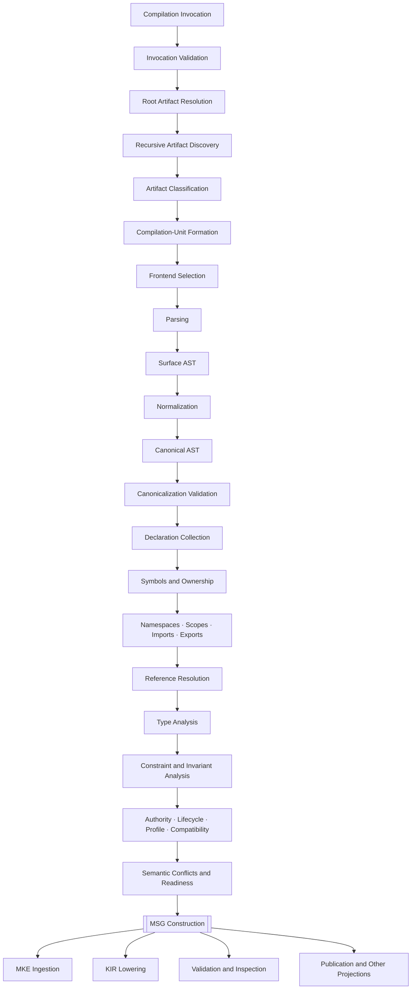

---

artifact:
id: MONAD-VISION-COMPILER-PIPELINE
type: vision.compiler-pipeline
namespace: monad

metadata:
title: Monad Compiler Pipeline
version: 0.1.0
status: draft
created: 2026-08-06
authors:
- Monad Architecture Team
tags:
- vision
- architecture
- compiler
- msc
- pipeline
- semantic-analysis
- msg
- kir
- incrementality
- reproducibility

relationships:
depends_on:
- MONAD-VISION-MANIFESTO
- MONAD-VISION-PRINCIPLES
- MONAD-VISION-LAWS
- MONAD-VISION-GLOSSARY
- MONAD-VISION-ECOSYSTEM
- MONAD-VISION-ARCHITECTURE-MAP
- MSC-CORE-0001
- MSC-CORE-0002
- MSC-CORE-0003
- MSC-CORE-0004
- MSC-CORE-0005
- MSC-CORE-0006
- MSC-CORE-0007
enables:
- MONAD-VISION-KNOWLEDGE-LIFECYCLE
- MONAD-VISION-CONSTITUTION
- MSC-CORE-0008
- MSC-CORE-0009
- MSC-CORE-0010
- MONAD-COMPILER-BOOTSTRAP
--------------------------

# Monad Compiler Pipeline

## 1. Purpose

This document defines the canonical architecture-level pipeline of the Monad Specification Compiler.

It explains how MSC transforms supported engineering artifacts into:

* validated compiler representations;
* analyzed semantic state;
* a Monad Semantic Graph;
* structured diagnostics;
* optional persistent, lowered, inspection, and publication outputs.

This document bridges:

* the high-level Monad architecture;
* the normative MSC-CORE specifications;
* future compiler implementation work;
* compiler tests;
* self-hosting plans.

It is implementation-oriented but not implementation-specific.

It does not prescribe:

* a programming language;
* package or crate names;
* concrete data structures;
* parser libraries;
* graph storage products;
* concurrency frameworks;
* deployment topology.

Normative MSC specifications govern detailed behavior. If this document conflicts with an accepted ADR or specification, the accepted ADR or specification governs and this document must be corrected.

---

# 2. Compiler Mission

The Monad Specification Compiler has one primary responsibility:

> Compile supported engineering artifacts into analyzed Monad Semantic Graph snapshots and optional derived compiler representations.

MSC is not merely:

* a Markdown parser;
* a document generator;
* a schema validator;
* a code generator;
* a database importer;
* an AI wrapper.

MSC establishes meaning through explicit, versioned compilation stages.

---

# 3. Core Compiler Principles

The compiler pipeline follows these principles.

## 3.1 Syntax Is Not Meaning

Parsing identifies valid structure.

It does not establish complete semantic validity.

## 3.2 Representations Must Remain Distinct

The following are separate:

* source artifact;
* surface AST;
* canonical AST;
* declaration state;
* compiler symbol state;
* resolved-reference state;
* semantic-analysis state;
* MSG;
* KIR;
* persistent MKE knowledge;
* publication output.

## 3.3 Every Phase Has One Primary Responsibility

A phase may collect supporting metadata, but it must not absorb unrelated downstream responsibilities.

## 3.4 Phase Boundaries Are Explicit

Every major phase consumes a declared input representation and produces a stable output representation.

## 3.5 Downstream Phases Consume Stable State

A phase output must be:

* immutable; or
* completely fingerprinted and observationally stable.

## 3.6 Partial Knowledge Must Remain Explicit

The compiler may preserve:

* unsupported artifacts;
* unresolved references;
* unknown types;
* deferred constraints;
* contested authority;
* semantic conflicts.

It must not invent certainty to complete the pipeline.

## 3.7 Canonical Meaning Begins at MSG

Canonical AST is the common compiler representation.

MSG is the canonical semantic representation of one compilation snapshot.

## 3.8 Persistence Is Separate from Compilation

MKE may ingest MSG, but MKE does not perform MSC's core semantic compilation.

## 3.9 Lowering Is Derived

KIR and backend outputs are derived from semantic knowledge.

They do not redefine MSG.

## 3.10 Equivalent Inputs Produce Equivalent Meaning

Equivalent declared inputs, versions, configuration, and environment must produce semantically equivalent deterministic outputs.

---

# 4. Pipeline Overview

```text
Compilation Invocation
        │
        ▼
Invocation Validation
        │
        ▼
Root Artifact Resolution
        │
        ▼
Recursive Artifact Discovery
        │
        ▼
Artifact Classification
        │
        ▼
Compilation-Unit Formation
        │
        ▼
Frontend Selection
        │
        ▼
Parsing
        │
        ▼
Surface AST Construction
        │
        ▼
Normalization
        │
        ▼
Canonical AST Construction
        │
        ▼
Canonicalization Validation
        │
        ▼
Declaration Collection
        │
        ▼
Symbol and Ownership Binding
        │
        ▼
Namespace and Scope Construction
        │
        ▼
Import, Export, and Alias Resolution
        │
        ▼
Reference Collection and Resolution
        │
        ▼
Type Environment Construction
        │
        ▼
Type Analysis
        │
        ▼
Constraint and Invariant Analysis
        │
        ▼
Authority and Lifecycle Analysis
        │
        ▼
Profile, Feature, and Compatibility Analysis
        │
        ▼
Semantic Conflict Construction
        │
        ▼
Semantic Readiness Evaluation
        │
        ▼
MSG Construction
        │
        ├──► MKE Ingestion
        ├──► KIR Lowering
        ├──► Validation Reports
        ├──► Inspection Outputs
        └──► Publication and Other Projections
```

This is the conceptual order.

Implementations may parallelize or dependency-schedule compatible work while preserving these semantic dependencies.

---

## 4.1 Pipeline Diagram



---

# 5. Compilation Invocation

A compilation begins with a versioned invocation record.

Conceptually:

```text
CompilationInvocation

├── invocation_id
├── root_inputs
├── repository_or_workspace_context
├── requested_profile
├── requested_features
├── requested_outputs
├── dependency_policy
├── extension_policy
├── trust_policy
├── network_policy
├── filesystem_policy
├── resource_policy
├── reproducibility_policy
├── environment_declaration
├── registry_snapshots
├── prior_snapshot
├── cache_policy
└── caller_context
```

The invocation must be explicit enough to reproduce the requested semantic result.

---

## 5.1 Invocation Identity

Every compilation invocation requires a compiler-visible identity.

The identity supports:

* diagnostics;
* logs;
* cache tracing;
* artifact lineage;
* MKE ingestion;
* CI reporting;
* comparison;
* cancellation.

Invocation identity is not semantic artifact identity.

---

## 5.2 Root Inputs

Root inputs may include:

* file paths;
* artifact identities;
* package identities;
* workspace manifests;
* repository manifests;
* in-memory buffers;
* external artifact descriptors;
* prior knowledge references.

The compiler must not infer a broad workspace merely because a directory is reachable.

Discovery scope is governed by invocation and manifest policy.

---

## 5.3 Requested Outputs

Possible outputs include:

* MSG;
* KIR;
* MKE ingestion;
* diagnostic report;
* canonical AST export;
* symbol-table export;
* reference-graph export;
* analysis snapshot;
* diagrams;
* publication projections;
* backend outputs.

MSG is the canonical semantic compiler output.

Other outputs may be optional or invocation-required.

---

## 5.4 Invocation Validation

Before discovery, MSC validates:

* root syntax;
* root availability;
* requested profiles;
* requested output targets;
* compiler compatibility;
* registry availability;
* extension permissions;
* resource limits;
* network and filesystem policies;
* prior-cache compatibility.

Invalid invocation state must fail before uncontrolled discovery or extension execution.

---

# 6. Compilation-Unit Formation

A compilation unit is the coordinated semantic boundary for one compiler run or sub-run.

Conceptually:

```text
CompilationUnit

├── unit_id
├── root_artifacts
├── discovered_artifacts
├── contained_artifacts
├── dependency_artifacts
├── language_assignments
├── package_context
├── namespace_roots
├── selected_profiles
├── selected_features
├── extension_set
├── dependency_snapshot
├── registry_snapshot
├── environment
├── prior_state
├── requested_outputs
└── fingerprint
```

A compilation unit determines which artifacts are analyzed together and under which semantic context.

---

## 6.1 Unit Boundaries

A unit may correspond to:

* one artifact;
* one package;
* one repository;
* one workspace;
* one dependency component;
* one incremental subgraph.

Unit formation must remain explicit.

---

## 6.2 Unit Graph

A larger invocation may contain several compilation units connected by:

* import dependencies;
* package dependencies;
* ontology dependencies;
* language dependencies;
* version dependencies;
* historical dependencies.

Unit order must derive from dependency semantics rather than directory traversal order.

---

# 7. Phase Catalog

## 7.1 Invocation Validation

### Responsibility

Validate the requested compilation operation.

### Inputs

* compilation invocation;
* compiler capabilities;
* registry availability;
* policy configuration.

### Outputs

* validated invocation;
* invocation diagnostics;
* initial reproducibility context.

### Barrier

No artifact discovery begins until required invocation state is valid.

---

## 7.2 Root Artifact Resolution

### Responsibility

Resolve invocation roots into artifact descriptors.

### Inputs

* validated root references;
* repository or workspace context;
* filesystem and network policy.

### Outputs

* root artifact descriptors;
* unavailable-root diagnostics;
* root provenance.

### Barrier

Every required root has an explicit outcome:

* resolved;
* missing;
* inaccessible;
* prohibited;
* unsupported;
* deferred.

---

## 7.3 Recursive Artifact Discovery

### Responsibility

Locate artifacts that participate in the compilation.

### Inputs

* root artifacts;
* containment rules;
* manifest rules;
* import hints;
* discovery providers;
* limits.

### Outputs

* discovered artifact graph;
* containment relationships;
* discovery diagnostics;
* discovery fingerprint.

### Rules

Discovery must be:

* bounded;
* deterministic under equivalent inputs;
* provenance-preserving;
* policy-controlled.

Discovery must not parse arbitrary content merely to decide whether it should exist.

---

## 7.4 Artifact Classification

### Responsibility

Determine the representation, language, version, role, and candidate frontend for each artifact.

### Inputs

* artifact descriptors;
* filenames and metadata;
* declared media types;
* language manifests;
* content signatures where permitted.

### Outputs

* classified artifact descriptors;
* candidate frontend assignments;
* ambiguity records;
* unsupported-artifact records.

### Barrier

Every artifact has an explicit classification outcome.

---

## 7.5 Compilation-Unit Formation

### Responsibility

Group classified artifacts into coordinated semantic compilation boundaries.

### Inputs

* classified artifact graph;
* packages;
* manifests;
* dependency context;
* profiles;
* requested outputs.

### Outputs

* compilation-unit graph;
* unit dependency order;
* cycle classification;
* unit fingerprints.

---

## 7.6 Frontend Selection

### Responsibility

Choose the compatible frontend or direct canonical provider for each artifact.

### Inputs

* artifact classification;
* language and syntax version;
* frontend registry;
* trust policy;
* compatibility policy.

### Outputs

* frontend assignment;
* frontend version;
* unsupported or ambiguous frontend diagnostics.

### Rules

Frontend selection must not depend on registration order.

---

## 7.7 Parsing

### Responsibility

Transform a supported source representation into structured syntax.

### Inputs

* source artifact;
* source bytes or representation handle;
* frontend;
* syntax version;
* parsing profile.

### Outputs

* surface AST;
* direct canonical fragment where explicitly supported;
* parse diagnostics;
* source map;
* trivia or presentation metadata where preserved.

### Boundary

Parsing does not establish complete semantic validity.

---

## 7.8 Surface AST Construction

### Responsibility

Represent source-language concepts and structure.

A surface AST may preserve:

* source-specific declarations;
* document hierarchy;
* syntax variants;
* source locations;
* comments;
* embedded regions;
* format-specific semantics.

It is frontend-specific.

---

## 7.9 Normalization

### Responsibility

Map surface-language concepts into canonical MSL concepts.

### Inputs

* surface AST;
* normalization mapping;
* mapping version;
* language profile;
* extension contracts.

### Outputs

* canonical AST fragments;
* mapping lineage;
* unsupported semantic records;
* ambiguity records;
* loss records;
* normalization diagnostics.

### Rules

Normalization must not silently discard unsupported meaning.

---

## 7.10 Canonical AST Construction

### Responsibility

Assemble normalized fragments into the shared compiler representation.

The canonical AST provides:

* common node categories;
* canonical identity hooks;
* canonical ownership structure;
* normalized relationship forms;
* source lineage;
* extension preservation.

It is not MSG.

---

## 7.11 Canonicalization Validation

### Responsibility

Validate that canonical AST state satisfies shared compiler invariants.

Validation includes:

* node identity;
* node kind;
* ownership;
* required fields;
* source lineage;
* version compatibility;
* extension contracts;
* containment integrity.

### Barrier

Canonical AST must be immutable or fully fingerprinted before common semantic passes proceed.

---

## 7.12 Declaration Collection

### Responsibility

Identify canonical constructs that introduce semantic declarations.

### Inputs

* canonical AST snapshot;
* language declaration contracts.

### Outputs

* declaration table;
* declaration identities;
* candidate ownership;
* duplicate and collision records.

Declaration collection identifies what exists.

It does not resolve every reference to it.

---

## 7.13 Symbol and Ownership Binding

### Responsibility

Create compiler-visible symbols and bind ownership relationships.

### Inputs

* declaration table;
* canonical AST;
* identity rules.

### Outputs

* symbol snapshot;
* ownership graph;
* member indexes;
* collision diagnostics.

Symbols are compiler representations.

They are not durable semantic identities.

---

## 7.14 Namespace and Scope Construction

### Responsibility

Build the semantic lookup contexts used by resolution.

### Inputs

* symbol snapshot;
* declarations;
* namespace declarations;
* package context;
* language rules.

### Outputs

* namespace graph;
* scope graph;
* visibility state;
* namespace diagnostics.

Namespaces are semantic.

They must not be inferred solely from directories.

---

## 7.15 Import, Export, and Alias Resolution

### Responsibility

Determine semantic availability across scopes, namespaces, packages, and artifacts.

### Inputs

* namespace graph;
* scope graph;
* package graph;
* import declarations;
* export declarations;
* alias declarations;
* version policy.

### Outputs

* import graph;
* export surfaces;
* alias graph;
* cycle classification;
* import diagnostics.

---

## 7.16 Reference Collection and Resolution

### Responsibility

Bind semantic references to explicit outcomes.

### Inputs

* canonical AST;
* symbol snapshot;
* namespaces;
* scopes;
* imports;
* aliases;
* reference-kind rules.

### Outputs

* reference graph;
* selected targets;
* candidate targets;
* lookup traces;
* unresolved references;
* ambiguity records;
* conflict records.

### Required Outcomes

Every relevant reference must be marked:

* resolved;
* unresolved;
* ambiguous;
* conflicting;
* deferred;
* invalid;
* intentionally external.

---

## 7.17 Type Environment Construction

### Responsibility

Build the type context governing declarations and expressions.

### Inputs

* symbols;
* resolved references;
* language type contracts;
* aliases;
* profiles;
* features;
* compatibility rules.

### Outputs

* type environments;
* visible type sets;
* variables;
* conversions;
* type dependencies.

---

## 7.18 Type Analysis

### Responsibility

Determine declared, inferred, narrowed, deferred, conflicting, and effective types.

### Inputs

* type environments;
* declarations;
* references;
* literals;
* constraints;
* language rules.

### Outputs

* type-analysis snapshot;
* assignability results;
* conversion records;
* narrowing evidence;
* type conflicts;
* diagnostics.

---

## 7.19 Constraint and Invariant Analysis

### Responsibility

Bind constraints to subjects, classify evaluation phases, and evaluate applicable compile-time conditions.

### Inputs

* analyzed types;
* resolved targets;
* constraint-language contracts;
* profiles;
* environment declaration.

### Outputs

* constraint graph;
* bound constraints;
* evaluation results;
* deferred constraints;
* invariant violations;
* evidence records.

---

## 7.20 Authority and Lifecycle Analysis

### Responsibility

Determine the effective standing and applicability of semantic knowledge.

### Inputs

* declarations;
* origins;
* imports;
* adoption evidence;
* authority rules;
* lifecycle state;
* supersession;
* profiles.

### Outputs

* effective authority;
* lifecycle applicability;
* authority conflicts;
* transition diagnostics;
* supersession relationships.

Authority and lifecycle remain distinct.

---

## 7.21 Profile, Feature, and Compatibility Analysis

### Responsibility

Determine which semantic rules and capabilities apply to the invocation and requested outputs.

### Inputs

* active profiles;
* feature requirements;
* language versions;
* compiler versions;
* extension versions;
* MSG target;
* KIR target;
* backend target.

### Outputs

* active profile state;
* feature-negotiation results;
* compatibility results;
* migration-required state;
* blocked-output records.

---

## 7.22 Semantic Conflict Construction

### Responsibility

Represent incompatible semantic claims as first-class compiler artifacts.

### Inputs

* declarations;
* types;
* constraints;
* authority;
* lifecycle;
* compatibility;
* evidence.

### Outputs

* semantic conflicts;
* affected subjects;
* blocking-output classification;
* resolution state.

Conflicts must not be resolved through pass order.

---

## 7.23 Semantic Readiness Evaluation

### Responsibility

Determine which semantic outputs are permitted.

### Inputs

* all semantic-analysis results;
* conflicts;
* profiles;
* requested outputs;
* target-specific requirements.

### Outputs

* MSG readiness;
* KIR readiness;
* backend readiness;
* publication readiness;
* blocked-output reasons.

MSG readiness and KIR readiness are distinct.

---

## 7.24 MSG Construction

### Responsibility

Construct the canonical logical semantic graph for the compilation snapshot.

### Inputs

* frozen semantic-analysis snapshot;
* ontology contracts;
* graph-construction profile.

### Outputs

* immutable MSG;
* graph fingerprint;
* graph diagnostics;
* graph provenance;
* graph completeness and readiness metadata.

MSG construction is the semantic culmination of MSC.

---

## 7.25 MKE Ingestion

### Responsibility

Submit an MSG snapshot to MKE through a versioned ingestion contract.

### Inputs

* MSG;
* ingestion policy;
* repository or workspace identity;
* expected prior state;
* persistence transaction policy.

### Outputs

* ingestion result;
* persistent snapshot identity;
* knowledge diff;
* conflict or migration result;
* persistence diagnostics.

This is downstream of semantic compilation.

---

## 7.26 KIR Lowering

### Responsibility

Transform MSG into a more constrained target-oriented representation.

### Inputs

* MSG;
* target profile;
* backend contract;
* lowering rules;
* target capabilities.

### Outputs

* KIR;
* lowering diagnostics;
* semantic loss report;
* unsupported-target records;
* target fingerprint.

KIR lowering may require stricter readiness than MSG construction.

---

## 7.27 Reporting and Projection

### Responsibility

Present compiler outcomes to users and systems.

Possible outputs include:

* human-readable diagnostics;
* JSON diagnostics;
* CI reports;
* graph exports;
* canonical AST inspection;
* symbol and reference inspection;
* documentation;
* diagrams;
* publication views.

Rendered reports are projections of structured compiler state.

---

# 8. Pipeline Phase Matrix

| Phase                  | Primary Input                | Primary Output                | Primary Responsibility                    |
| ---------------------- | ---------------------------- | ----------------------------- | ----------------------------------------- |
| Invocation validation  | invocation request           | validated invocation          | Validate the compilation context          |
| Root resolution        | root references              | root descriptors              | Resolve requested entry artifacts         |
| Discovery              | roots and policies           | artifact graph                | Locate bounded inputs                     |
| Classification         | artifact descriptors         | classified artifacts          | Identify representation and language      |
| Unit formation         | classified artifacts         | compilation units             | Establish coordinated boundaries          |
| Frontend selection     | classified artifacts         | frontend assignments          | Select compatible implementations         |
| Parsing                | source representation        | surface AST                   | Establish syntactic structure             |
| Normalization          | surface AST                  | canonical fragments           | Map source concepts to canonical concepts |
| Canonicalization       | canonical fragments          | canonical AST snapshot        | Validate shared compiler structure        |
| Declaration collection | canonical AST                | declaration table             | Identify declared entities                |
| Symbol binding         | declarations                 | symbol snapshot               | Create compiler-visible entities          |
| Scope construction     | symbols and declarations     | namespace/scope/import graphs | Establish lookup contexts                 |
| Reference resolution   | references and lookup graphs | reference snapshot            | Bind references                           |
| Type analysis          | declarations and references  | type results                  | Determine effective types                 |
| Constraint analysis    | analyzed semantics           | constraint results            | Bind and evaluate conditions              |
| Governance analysis    | semantics and policies       | authority/lifecycle results   | Determine standing and applicability      |
| Compatibility analysis | versions and features        | compatibility results         | Determine interoperability                |
| Conflict/readiness     | all analysis state           | semantic snapshot             | Preserve conflicts and permit outputs     |
| MSG construction       | semantic snapshot            | MSG                           | Construct canonical semantic knowledge    |
| MKE ingestion          | MSG                          | persistent knowledge result   | Persist semantic history                  |
| KIR lowering           | MSG and target               | KIR                           | Produce target-oriented representation    |
| Reporting              | all compiler state           | reports and projections       | Explain compilation outcomes              |

---

# 9. Representation Catalog

## Artifact Descriptor

Represents an identified input artifact before parsing.

Contains:

* artifact identity;
* origin;
* location;
* media type;
* declared role;
* version;
* provenance;
* trust state;
* content fingerprint.

---

## Source Representation Handle

Provides controlled access to source bytes or structured external content.

It should abstract:

* files;
* in-memory buffers;
* remote artifacts;
* generated inputs;
* connector-backed content.

---

## Parse Result

Contains:

* surface AST or direct canonical fragment;
* source map;
* parse diagnostics;
* parser identity and version;
* consumed source fingerprint.

---

## Surface AST

Represents source-language structure.

It may preserve presentation and source-specific concepts.

---

## Normalized Fragment

Represents the output of one normalization mapping before complete canonical assembly.

---

## Canonical AST

Represents normalized shared compiler concepts.

It is the principal input to common semantic passes.

---

## Declaration Table

Indexes every collected declaration and its canonical source node.

---

## Symbol Snapshot

Represents compiler-visible declarations, members, ownership, and lookup metadata.

---

## Namespace Graph

Represents semantic namespace relationships.

---

## Scope Graph

Represents name-lookup contexts and traversal rules.

---

## Import Graph

Represents dependencies introduced through semantic imports.

---

## Export Surface

Represents the declarations made visible to importers.

---

## Alias Graph

Represents alternate names and identity redirects.

---

## Reference Graph

Represents reference sites, candidate targets, selected targets, and resolution outcomes.

---

## Type-Analysis Snapshot

Represents declared, inferred, narrowed, effective, unknown, deferred, conflicting, and error type states.

---

## Constraint Graph

Represents constraints, targets, dependencies, evaluation phases, results, and evidence.

---

## Semantic-Analysis Snapshot

Contains:

* type results;
* constraint results;
* authority;
* lifecycle;
* profiles;
* features;
* compatibility;
* conflicts;
* readiness;
* provenance;
* diagnostics.

It is the immediate input to MSG construction.

---

## Monad Semantic Graph

Represents canonical analyzed knowledge for one compilation snapshot.

---

## Knowledge Intermediate Representation

Represents a lowered target-oriented projection.

---

## Diagnostic Bundle

An append-only collection of structured diagnostics until finalization.

---

## Compilation Report

Summarizes:

* invocation;
* phase outcomes;
* semantic status;
* output availability;
* diagnostics;
* timings;
* fingerprints;
* cache behavior;
* produced artifacts.

---

# 10. Representation Ownership

| Representation             | Producer                         | Primary Consumer                  |   Mutable After Barrier? |
| -------------------------- | -------------------------------- | --------------------------------- | -----------------------: |
| Artifact descriptor        | discovery                        | classification and unit formation |                       No |
| Surface AST                | frontend/parser                  | normalizer                        |                       No |
| Canonical AST              | normalizer or canonical frontend | common compiler passes            |                       No |
| Declaration table          | declaration collector            | binder and analysis               |                       No |
| Symbol snapshot            | binder                           | scope and reference analysis      |                       No |
| Namespace/scope graphs     | scope builder                    | resolver                          |                       No |
| Reference snapshot         | resolver                         | semantic analysis                 |                       No |
| Type-analysis snapshot     | type analyzer                    | constraints and readiness         |                       No |
| Constraint graph           | constraint analyzer              | readiness and MSG builder         |                       No |
| Semantic-analysis snapshot | semantic analyzer                | MSG builder                       |                       No |
| MSG                        | MSG builder                      | MKE, lowerers, services           |                       No |
| KIR                        | lowerer                          | backend                           |                       No |
| Diagnostic bundle          | all phases                       | diagnostic aggregator             | Append-only until frozen |
| Compilation report         | coordinator                      | users and integrations            |                       No |

---

# 11. Compiler Barriers

## 11.1 Invocation Barrier

Before discovery:

* required invocation fields are valid;
* profiles exist;
* requested outputs are recognized;
* policies are coherent;
* resource bounds are established.

---

## 11.2 Discovery Barrier

Before classification and unit formation:

* roots have explicit outcomes;
* discovered artifacts have identity;
* containment is known;
* discovery limits were enforced;
* required missing artifacts are diagnosed;
* discovery state is fingerprinted.

---

## 11.3 Parse Barrier

Before normalization:

* every required supported artifact has a parse outcome;
* failures are explicit;
* source locations are preserved;
* frontend versions are recorded;
* parse state is stable.

---

## 11.4 Canonicalization Barrier

Before declaration collection:

* canonical node structure is valid;
* node identity hooks exist;
* unsupported semantics are explicit;
* normalization losses are recorded;
* source lineage is complete;
* canonical AST is frozen.

---

## 11.5 Declaration-Binding Barrier

Before namespace and reference analysis:

* declarations are collected;
* symbols exist;
* ownership is explicit;
* duplicate and collision states are represented;
* symbol state is frozen.

---

## 11.6 Resolution Barrier

Before semantic analysis:

* namespaces and scopes exist;
* import and export state is explicit;
* aliases are classified;
* references have explicit outcomes;
* ambiguity and conflict are preserved;
* resolution snapshot is frozen.

---

## 11.7 Semantic-Analysis Barrier

Before MSG construction:

* type states are assigned;
* constraints are bound;
* static constraints are evaluated where applicable;
* deferred constraints are classified;
* authority is explicit;
* lifecycle applicability is explicit;
* profile and feature analysis is complete;
* compatibility is recorded;
* conflicts exist as artifacts;
* readiness is assigned;
* semantic snapshot is frozen.

---

## 11.8 MSG-Construction Barrier

Before persistence or lowering:

* ontology contracts are satisfied;
* graph nodes and edges are valid;
* provenance is complete;
* compiler-only state is excluded or explicitly represented;
* graph identity exists;
* graph fingerprint exists;
* MSG is immutable.

---

## 11.9 Lowering Barrier

Before backend execution:

* target profile exists;
* target compatibility is known;
* target-required readiness is achieved;
* losses are explicit;
* unsupported semantics are classified;
* KIR is immutable.

---

# 12. Pass Scheduling

The conceptual pipeline does not require every phase to execute as one serial loop.

## Linear Passes

Run once after their dependencies.

Examples:

* invocation validation;
* final canonical assembly;
* final report construction.

## Parallel Map Passes

Operate independently over artifacts or graph regions.

Examples:

* parsing unrelated artifacts;
* local syntax checks;
* independent normalization;
* some declaration-local validation.

Parallel results must merge deterministically.

## Dependency-Scheduled Passes

Run according to semantic dependency order.

Examples:

* package imports;
* type dependencies;
* module exports;
* reference resolution.

## Fixed-Point Pass Groups

Repeat until stable or bounded failure.

Examples:

* mutually recursive types;
* compatible cyclic constraints;
* monotonic authority propagation;
* cyclic imports explicitly supported by a language.

Every fixed-point group must define:

* monotonic state;
* stable ordering;
* termination condition;
* maximum iterations;
* nontermination diagnostics.

## Deferred Passes

Run only when required by a requested output or available dependency.

Examples:

* backend lowering;
* publication;
* external evidence;
* MKE ingestion.

## Target-Specific Passes

Run under one target contract.

Examples:

* Rust generation;
* OpenAPI projection;
* documentation rendering;
* deployment-plan generation.

---

# 13. Pass Registration

Every pass should declare:

```text
CompilerPass

├── pass_id
├── version
├── phase
├── input_contract
├── output_contract
├── dependencies
├── scheduling_class
├── determinism
├── cacheability
├── resource_class
├── extension_origin
├── trust_class
└── diagnostic_namespace
```

Pass execution order must derive from dependencies and declared scheduling rules.

It must not derive from plugin registration order.

---

# 14. Output Model

## 14.1 Mandatory Attempt Outputs

Every compilation attempt produces:

* compilation identity;
* validated or rejected invocation state;
* phase-status summary;
* structured diagnostics;
* reproducibility metadata;
* output-availability map;
* cancellation or failure state;
* compiler and extension version inventory.

---

## 14.2 Mandatory Successful Semantic Output

A successful semantic compilation produces:

* MSG.

An invocation may define partial MSG as a valid requested result where incomplete states are explicit.

---

## 14.3 Optional Outputs

Possible optional outputs include:

* canonical AST export;
* declaration table;
* symbol snapshot;
* namespace graph;
* import graph;
* reference graph;
* semantic-analysis snapshot;
* KIR;
* MKE ingestion;
* documentation;
* graph diagrams;
* debug trace;
* cache updates.

---

## 14.4 Output Availability

Every requested output has one explicit state:

```text
available
available_with_warnings
partial
blocked
not_requested
unsupported
failed
cancelled
```

An output being blocked does not imply all compilation failed.

---

## 14.5 Atomicity

An invocation may request:

* independent outputs;
* grouped atomic outputs;
* fully atomic invocation behavior.

Example:

A CI invocation may require MSG and KIR atomically.

An editor invocation may accept partial semantic state without KIR.

Atomicity must be declared rather than assumed.

---

# 15. Compilation Outcomes

Canonical invocation outcomes include:

```text
success
success_with_warnings
partial
blocked
failed
cancelled
resource_exhausted
internal_error
```

## Success

All required outputs are available.

## Success with Warnings

All required outputs are available, but nonblocking diagnostics exist.

## Partial

Useful semantic state exists, but one or more requested or expected areas remain incomplete.

## Blocked

Inputs may be valid, but required dependencies, authority, lifecycle, compatibility, or target readiness prevent requested outputs.

## Failed

User-controlled input or semantic errors prevent the required result.

## Cancelled

Execution was intentionally stopped.

## Resource Exhausted

A configured resource bound prevented completion.

## Internal Error

The compiler violated its own invariants or encountered an unexpected implementation failure.

Internal error must remain distinct from invalid user input.

---

# 16. Partial Compilation

Partial compilation is a first-class capability.

It may preserve:

* successfully parsed artifacts;
* failed artifacts;
* unsupported artifacts;
* placeholder declarations;
* unresolved references;
* ambiguous references;
* unknown types;
* deferred constraints;
* contested authority;
* draft lifecycle states;
* semantic conflicts;
* unavailable outputs.

Partial results must declare:

* guarantees available;
* guarantees unavailable;
* blocked operations;
* affected subjects;
* resume dependencies.

---

## 16.1 Unsupported Artifacts

An unsupported artifact must remain:

* identified;
* fingerprinted;
* provenance-preserving;
* explicitly unsupported.

Readable text must not be treated as semantically understood automatically.

---

## 16.2 Placeholders

A placeholder may preserve dependency shape when a required declaration is unavailable.

It must identify:

* expected identity or domain;
* origin of expectation;
* missing dependency;
* operations it blocks;
* replacement condition.

---

## 16.3 Recovery Types and Nodes

Compiler recovery representations must not escape as valid authoritative MSG semantics unless explicitly modeled as incomplete knowledge.

---

# 17. Semantic Readiness

Readiness is output-specific.

Possible readiness levels include:

```text
unavailable
partial
bound
resolved
typed
constraint_bound
analyzed
validated
authoritative
msg_ready
kir_ready
backend_ready
blocked
```

A declaration may be:

* MSG-ready;
* not KIR-ready;
* suitable for documentation;
* unsuitable for code generation.

This is valid.

---

# 18. MSG Construction Boundary

MSG construction converts analyzed compiler state into canonical semantic knowledge.

## 18.1 Eligible Content

MSG may include:

* artifacts;
* declarations;
* semantic identities;
* types;
* semantic properties;
* relationships;
* constraints;
* authority;
* lifecycle;
* provenance;
* evidence;
* conflicts;
* unknowns;
* deferred states;
* compatibility;
* supersession;
* readiness.

## 18.2 Compiler-Only Content

The following normally remains outside MSG:

* parser stacks;
* token streams;
* transient syntax-recovery nodes;
* hash-map bucket order;
* pass-local work queues;
* rejected lookup paths not needed for explanation;
* cache implementation state;
* backend-local temporary values.

Compiler-only state may be exported separately for debugging.

## 18.3 Promotion Rule

Compiler state becomes MSG knowledge only through an explicit graph-construction rule.

## 18.4 Graph Determinism

Equivalent frozen semantic snapshots and ontology versions must produce semantically equivalent MSGs.

---

# 19. MKE Handoff

MKE ingestion is downstream of MSG construction.

```text
MSC Semantic Compilation
        │
        ▼
MSG
        │
        ▼
Versioned Ingestion Contract
        │
        ▼
MKE Persistent Knowledge
```

## 19.1 Handoff Requirements

The ingestion request should contain:

* MSG identity;
* graph fingerprint;
* compilation identity;
* repository or workspace identity;
* ontology version;
* expected parent state;
* ingestion mode;
* authority context;
* migration policy;
* atomicity policy.

## 19.2 Failure Separation

The following are distinct:

* semantic compilation failure;
* MSG validation failure;
* ingestion compatibility failure;
* storage transaction failure;
* storage-provider failure.

A successful MSG does not become semantically invalid because a storage backend is unavailable.

## 19.3 Persistence Semantics

MKE must preserve:

* semantic identity;
* graph lineage;
* version history;
* authority;
* lifecycle;
* provenance;
* conflicts;
* snapshot relationships.

---

# 20. KIR Lowering

KIR is a derived target-oriented representation.

## 20.1 Lowering Inputs

* MSG;
* target identity;
* target version;
* backend contract;
* lowering profile;
* target capabilities;
* compatibility rules.

## 20.2 Lowering Outputs

* KIR;
* target readiness;
* unsupported semantic records;
* semantic loss report;
* lowering diagnostics;
* KIR fingerprint.

## 20.3 Lowering Rules

1. KIR must trace back to MSG.
2. Lowering may be lossy only when losses are explicit.
3. Unsupported knowledge must not disappear silently.
4. Target defaults must remain distinguishable from authored knowledge.
5. Backend limitations must not redefine canonical meaning.
6. Different targets may produce different KIR projections from one MSG.
7. KIR failure does not invalidate MSG automatically.

---

# 21. Diagnostics

Diagnostics are structured compiler artifacts.

Conceptually:

```text
Diagnostic

├── diagnostic_id
├── code
├── severity
├── phase
├── subject
├── source_locations
├── semantic_identity
├── message
├── explanation
├── related_diagnostics
├── evidence
├── remediation
├── blocking_outputs
├── provenance
└── fingerprint
```

---

## 21.1 Diagnostic Flow

```text
Phase-Local Finding
        │
        ▼
Structured Diagnostic
        │
        ▼
Identity and Lineage Attachment
        │
        ▼
Aggregation and Deduplication
        │
        ▼
Profile and Severity Evaluation
        │
        ▼
Output-Availability Effect
        │
        ▼
Human / JSON / Editor / CI Projection
```

---

## 21.2 Severity

Initial severity classes may include:

* fatal;
* error;
* warning;
* information;
* advice.

Severity and blocking effect are related but not identical.

A warning may block a strict profile.

An error may be local and permit partial output.

---

## 21.3 Deduplication

Diagnostic deduplication must use semantic identity and stable cause, not message text alone.

---

## 21.4 Suppression

Suppression must be:

* explicit;
* scoped;
* provenance-preserving;
* profile-aware;
* visible in reports.

Suppression does not erase the underlying finding.

---

## 21.5 Explanation

The compiler should be able to explain:

* frontend selection;
* import resolution;
* symbol collisions;
* reference candidates;
* type selection;
* conversions;
* constraint deferral;
* authority derivation;
* lifecycle blocking;
* compatibility;
* readiness;
* cache reuse;
* output blocking.

---

# 22. Incremental Compilation

Incremental compilation recomputes only affected state while preserving clean-build semantic equivalence.

## 22.1 Core Invariant

> Incremental and clean compilation under equivalent inputs must produce semantically equivalent outputs.

---

## 22.2 Invalidation Is Dependency-Driven

Invalidation must not rely only on changed filenames.

It may depend on:

* artifact bytes;
* artifact identity;
* parser version;
* normalization rules;
* canonical schema;
* declaration identity;
* export surface;
* type dependencies;
* constraint dependencies;
* authority rules;
* lifecycle state;
* profile;
* feature set;
* ontology version;
* target backend;
* evidence validity.

---

## 22.3 Invalidation Examples

| Change                         | Minimum Invalidated State                            |
| ------------------------------ | ---------------------------------------------------- |
| Presentation trivia only       | source mapping where semantics are unchanged         |
| Parsed syntax                  | surface AST and downstream state                     |
| Frontend version               | parse output and downstream state                    |
| Normalizer version             | canonical AST and downstream state                   |
| Canonical declaration identity | symbols, references, semantics, MSG, KIR             |
| Export surface                 | dependent imports and references                     |
| Type declaration               | dependent type and constraint analysis               |
| Constraint expression          | constraint dependents and readiness                  |
| Authority rule                 | applicability, readiness, MSG projection, KIR        |
| Lifecycle transition           | operation applicability and projections              |
| Profile                        | profile-sensitive analysis and outputs               |
| Ontology version               | MSG construction and semantic consumers              |
| Backend version                | target KIR and backend output                        |
| Storage provider               | MKE ingestion only if semantic contract is unchanged |

---

## 22.4 Negative Caches

Negative results may be cached, including:

* missing artifact;
* unsupported frontend;
* unresolved reference;
* incompatible version.

Negative caches must be invalidated when availability or governing context changes.

---

## 22.5 Cache Trust

A cache entry must declare:

* producer;
* producer version;
* input fingerprint;
* environment fingerprint;
* output fingerprint;
* trust class;
* validation state;
* expiration or invalidation rules.

Untrusted cache entries must be validated before use.

---

# 23. Reproducibility

A reproducible compilation records every input capable of changing semantic output.

## 23.1 Reproducibility Inputs

* artifact bytes or canonical external content;
* artifact identities;
* source versions;
* dependency versions;
* compiler version;
* frontend versions;
* parser versions;
* normalizer versions;
* canonical AST version;
* language versions;
* extension versions;
* ontology version;
* profile;
* feature set;
* registry snapshot;
* package resolution;
* solver versions;
* evaluator versions;
* environment declaration;
* target identity and version;
* resource policy where semantics may change;
* network-fetched content;
* clock or locale where semantically relevant;
* prior snapshot identity.

## 23.2 Forbidden Hidden Inputs

Semantic output must not depend silently on:

* machine hostname;
* filesystem enumeration order;
* hash-map order;
* current time;
* undeclared environment variables;
* remote latest versions;
* plugin registration order;
* network availability;
* AI-model nondeterminism;
* local user configuration outside the invocation context.

## 23.3 Reproducibility Record

Every compilation report should include a reproducibility fingerprint and a human-inspectable inventory.

---

# 24. Determinism

Core deterministic compilation requires:

* stable artifact ordering;
* stable declaration ordering;
* stable candidate ordering;
* stable diagnostic ordering;
* stable graph construction;
* stable serialization where serialization is requested;
* explicit nondeterministic extension classification.

AI-assisted or probabilistic passes must remain outside required deterministic core semantics unless their outputs are treated as provisional inputs with recorded origin.

---

# 25. Extension Boundaries

Extensions may participate through registered contracts.

## 25.1 Discovery Provider

May locate artifacts.

Must preserve:

* identity;
* provenance;
* discovery limits;
* deterministic ordering.

## 25.2 Frontend

May parse a supported representation.

Must declare:

* supported syntax;
* supported versions;
* determinism;
* resource behavior;
* output schema;
* diagnostics.

## 25.3 Normalizer

May map a surface AST to canonical AST.

Must preserve:

* source lineage;
* unsupported semantics;
* ambiguity;
* loss reporting.

## 25.4 Language Analyzer

May analyze registered language-specific nodes.

Must preserve shared identity, authority, lifecycle, and provenance contracts.

## 25.5 Constraint Evaluator

May evaluate supported constraints.

Must declare:

* logic;
* phase;
* proof capability;
* determinism;
* resource limits;
* sandbox requirements.

## 25.6 Graph Augmenter

May add registered semantic nodes or edges.

Must satisfy ontology and graph validation.

## 25.7 Lowerer

May produce KIR or backend-specific representations.

Must preserve target identity, readiness, and loss reports.

## 25.8 Renderer

May produce publications or visualizations.

Must not mutate canonical knowledge.

## 25.9 Storage Provider

May implement MKE persistence.

Must preserve the MKE semantic contract.

---

## 25.10 Invariants Extensions Cannot Bypass

Extensions cannot bypass:

* artifact identity;
* semantic identity;
* provenance;
* authority;
* lifecycle;
* versioning;
* structured diagnostics;
* deterministic ordering;
* resource policy;
* graph validation;
* snapshot immutability;
* trust policy;
* output-readiness rules.

---

# 26. Security and Trust Boundaries

## 26.1 Input Boundary

Source artifacts are untrusted.

The compiler must defend against:

* malformed syntax;
* path traversal;
* recursive inclusion;
* decompression bombs;
* oversized literals;
* excessive nesting;
* entity expansion;
* malicious embedded content;
* parser denial of service.

## 26.2 Frontend Boundary

Third-party parsers should operate under:

* memory limits;
* time limits;
* recursion limits;
* filesystem restrictions;
* network restrictions;
* output validation.

## 26.3 Extension Boundary

Extensions must receive the minimum capabilities necessary.

Capabilities may include:

* read selected artifact;
* emit canonical fragment;
* emit diagnostic;
* query registry;
* request controlled external access.

## 26.4 Constraint Boundary

Evaluators and solvers must be bounded.

Effectful constraints are prohibited during ordinary semantic analysis.

## 26.5 AI Boundary

AI providers are never part of the trusted deterministic core by default.

AI outputs must retain:

* provider;
* model;
* context lineage;
* invocation identity;
* provisional authority;
* validation state.

## 26.6 Persistence Boundary

Storage providers must not alter semantic meaning through backend normalization or lossy schemas.

## 26.7 Secret Boundary

Secrets must not enter ordinary compiler snapshots, diagnostics, publication projections, or AI context without explicit policy.

---

# 27. Resource Controls

Compiler policy may limit:

* artifact count;
* artifact size;
* total input size;
* recursion depth;
* AST depth;
* declaration count;
* namespace depth;
* import depth;
* reference candidate count;
* union size;
* type expansion;
* constraint count;
* solver time;
* fixed-point iterations;
* MSG node count;
* MSG edge count;
* diagnostic count;
* output size;
* extension execution time;
* network requests.

Limit exhaustion must produce a structured outcome.

It must not masquerade as semantic invalidity.

---

# 28. Failure Boundaries

The pipeline distinguishes:

| Failure                  | Meaning                                                    |
| ------------------------ | ---------------------------------------------------------- |
| Invocation failure       | Requested operation is invalid                             |
| Discovery failure        | Required input cannot be located                           |
| Classification failure   | Representation cannot be identified safely                 |
| Frontend failure         | No compatible frontend exists                              |
| Parse failure            | Syntax cannot be structured                                |
| Normalization failure    | Source semantics cannot be mapped                          |
| Canonicalization failure | Shared compiler invariants fail                            |
| Binding failure          | Declarations or ownership cannot be coherently represented |
| Resolution failure       | Required semantic references cannot be bound               |
| Type failure             | Required type relations are invalid                        |
| Constraint failure       | Applicable condition is violated                           |
| Governance failure       | Authority or lifecycle blocks the operation                |
| Compatibility failure    | Versions or features cannot interoperate                   |
| MSG failure              | Semantic graph invariants cannot be satisfied              |
| Persistence failure      | MKE cannot ingest or store valid MSG                       |
| Lowering failure         | Target projection cannot be produced                       |
| Internal failure         | Compiler implementation violated an invariant              |

Failures in later optional phases must not rewrite the meaning of earlier valid snapshots.

---

# 29. Compiler Coordination Model

A compiler coordinator is conceptually responsible for:

* validating invocation;
* building the pass graph;
* scheduling work;
* managing cancellation;
* applying resource policies;
* managing snapshots;
* collecting diagnostics;
* determining output availability;
* finalizing the report.

The coordinator must not own language semantics itself.

Semantics belong to registered language and compiler contracts.

---

# 30. Language-Neutral Implementation Boundaries

A future implementation may organize components around these boundaries.

```text
Compiler API
│
├── Invocation
├── Artifact System
│   ├── Root Resolver
│   ├── Discovery
│   ├── Classification
│   └── Content Access
│
├── Frontend System
│   ├── Frontend Registry
│   ├── Parser Contracts
│   └── Surface AST Contracts
│
├── Normalization System
│   ├── Mapping Registry
│   ├── Normalizers
│   └── Canonical AST Validation
│
├── Semantic Front End
│   ├── Declaration Collection
│   ├── Symbol Binding
│   ├── Namespace and Scope Graphs
│   └── Reference Resolution
│
├── Semantic Analysis
│   ├── Type System
│   ├── Constraint System
│   ├── Authority and Lifecycle
│   ├── Profiles and Features
│   ├── Compatibility
│   └── Conflict and Readiness
│
├── MSG Builder
├── Lowering System
├── Persistence Handoff
├── Diagnostics
├── Incremental Engine
├── Cache
├── Extension Host
├── Resource Governor
└── Compilation Report
```

These are implementation components, not necessarily separate deployable services.

---

# 31. Test Boundary Map

## Invocation Tests

Verify:

* validation;
* profile selection;
* output selection;
* policy conflict;
* reproducibility inputs.

## Discovery Tests

Verify:

* root resolution;
* containment;
* cycles;
* missing inputs;
* deterministic ordering;
* limits.

## Frontend Tests

Verify:

* valid syntax;
* invalid syntax;
* source maps;
* recovery;
* version handling;
* resource exhaustion.

## Normalization Tests

Verify:

* mapping correctness;
* provenance;
* unsupported semantics;
* ambiguity;
* loss reports;
* canonical conformance.

## Canonical AST Tests

Verify:

* identity;
* ownership;
* validation;
* serialization;
* version compatibility.

## Binding Tests

Verify:

* declarations;
* symbols;
* ownership;
* duplicate handling;
* collision diagnostics.

## Resolution Tests

Verify:

* namespaces;
* scopes;
* imports;
* exports;
* aliases;
* ambiguity;
* cycles;
* trace explanations.

## Type Tests

Verify:

* equivalence;
* assignability;
* conversions;
* narrowing;
* generics;
* recursion;
* unknown and deferred states.

## Constraint Tests

Verify:

* binding;
* evaluation classes;
* static results;
* deferral;
* fixed points;
* evidence.

## Governance Tests

Verify:

* authority derivation;
* adoption;
* lifecycle applicability;
* supersession;
* profile thresholds.

## MSG Tests

Verify:

* graph invariants;
* semantic identity;
* provenance;
* conflict representation;
* deterministic construction;
* incomplete knowledge.

## Incremental Tests

Verify:

* invalidation;
* cache reuse;
* negative cache;
* clean-build equivalence;
* version changes.

## Lowering Tests

Verify:

* readiness;
* target compatibility;
* semantic loss;
* unsupported targets;
* stable KIR.

## Persistence Tests

Verify:

* ingestion contracts;
* version lineage;
* transaction behavior;
* storage-provider equivalence.

## Security Tests

Verify:

* malformed input;
* sandboxing;
* resource limits;
* path policy;
* network policy;
* malicious extensions.

---

# 32. Test Types

The implementation should use:

* unit tests;
* golden tests;
* snapshot tests;
* conformance fixtures;
* integration tests;
* end-to-end tests;
* property-based tests;
* differential tests;
* fuzz tests;
* failure-injection tests;
* clean-versus-incremental equivalence tests;
* cross-version compatibility tests.

Test fixtures should themselves become identified engineering artifacts where practical.

---

# 33. Bootstrap Compiler Scope

The first implementation should be deliberately smaller than the complete architecture.

## 33.1 Required Bootstrap Inputs

* local files;
* a limited Markdown-based MSL profile;
* explicit repository or package roots;
* local dependency resolution;
* fixed language registry.

## 33.2 Required Bootstrap Phases

1. invocation validation;
2. local artifact discovery;
3. artifact classification;
4. Markdown frontend;
5. canonical AST construction;
6. declaration collection;
7. symbol binding;
8. simple namespaces;
9. direct reference resolution;
10. minimal primitive and reference types;
11. required-field and identity constraints;
12. basic authority and lifecycle fields;
13. MSG construction;
14. deterministic JSON or YAML graph export;
15. structured diagnostics.

## 33.3 Optional Bootstrap Features

* incremental cache;
* Mermaid graph export;
* MKE ingestion;
* one KIR backend;
* documentation projection.

## 33.4 Explicitly Deferred from Bootstrap

* remote artifact discovery;
* unrestricted plugins;
* AI-assisted compilation;
* advanced generics;
* theorem proving;
* distributed compilation;
* full runtime constraint evaluation;
* multi-organization federation;
* automatic publication engine.

---

# 34. Bootstrap Success Scenario

A minimal end-to-end success scenario is:

```text
User runs:
    monad compile specifications/

MSC:
    discovers supported specification artifacts
    parses bootstrap MSL Markdown
    constructs canonical AST
    collects declarations
    binds artifact identities
    resolves local references
    validates minimal types and constraints
    constructs MSG
    emits structured diagnostics
    writes deterministic MSG export
```

This proves the central architecture without requiring the complete ecosystem.

---

# 35. Self-Hosting Path

## Stage 0 — Manual Bootstrap

Specifications are authored and reviewed manually.

## Stage 1 — Structural Validation

MSC validates:

* front matter;
* identifiers;
* registry entries;
* relationships;
* required sections.

## Stage 2 — Semantic Compilation

MSC compiles core Monad specifications into MSG.

## Stage 3 — Persistent Knowledge

MKE ingests the compiled Monad graph.

## Stage 4 — Derived Documentation

Publication tooling derives reference and architecture pages.

## Stage 5 — Work-Packet Integration

The compiler and knowledge engine connect:

* work packets;
* specifications;
* commits;
* tests;
* outcomes.

## Stage 6 — Compiler Self-Description

MSC's implementation structure and passes are described by Monad artifacts.

## Stage 7 — Governed Self-Evolution

Monad uses its own knowledge and work model to plan, implement, verify, and publish changes to Monad.

Each stage requires implementation evidence before it is considered complete.

---

# 36. Pipeline Invariants

1. Every invocation has identity.
2. Every input artifact has identity and provenance.
3. Discovery is bounded.
4. Frontend selection is deterministic.
5. Parsing does not imply semantic validity.
6. Surface AST and canonical AST remain distinct.
7. Unsupported normalization is explicit.
8. Canonical AST is stable before common semantic passes.
9. Declaration identity and symbol identity remain distinct.
10. Ownership is explicit.
11. Namespace and scope remain distinct.
12. Imports, exports, aliases, and references remain distinct.
13. Every reference has an explicit outcome.
14. Type analysis preserves declared and inferred state.
15. Constraints declare evaluation phase.
16. Authority and lifecycle remain distinct.
17. Compatibility remains version-domain-specific.
18. Conflicts are first-class artifacts.
19. Readiness is output-specific.
20. Semantic-analysis state is stable before MSG construction.
21. MSG is the canonical semantic output of one compilation snapshot.
22. MKE ingestion is separate from MSG construction.
23. KIR is derived from MSG.
24. Optional-output failure does not silently invalidate MSG.
25. Diagnostics remain structured.
26. Incremental output equals clean-build semantics.
27. Hidden environmental inputs are prohibited.
28. Extensions cannot bypass shared invariants.
29. Resource exhaustion is explicit.
30. AI is not required for deterministic core compilation.
31. Snapshots are immutable or completely fingerprinted.
32. Source order does not determine semantic winners.
33. Registration order does not determine semantic winners.
34. Every output is traceable to invocation and inputs.
35. Compiler implementation details do not leak into semantic identity.

---

# 37. Architecture Review Checklist

Before implementing or modifying a compiler phase, verify:

* What is the phase's single responsibility?
* What representation does it consume?
* What representation does it produce?
* Is the input stable?
* Is the output stable?
* Which diagnostics can it emit?
* Which failures are recoverable?
* Which downstream outputs can it block?
* Which changes invalidate it?
* Can it run in parallel?
* Does it require a fixed point?
* Is it deterministic?
* Is it cacheable?
* Which extension points exist?
* Which resource limits apply?
* What provenance is added?
* What test categories cover it?
* Does it alter an accepted barrier?
* Does an ADR or specification authorize the change?

---

# 38. Completion Criteria for the Compiler Architecture

The pipeline architecture is sufficiently stable for implementation planning when:

* every major phase has one responsibility;
* phase representations are explicit;
* barriers are explicit;
* MSG, MKE, and KIR boundaries are unambiguous;
* partial compilation is defined;
* diagnostics are structured;
* incrementality has a soundness invariant;
* reproducibility inputs are known;
* extension trust boundaries are known;
* bootstrap scope is bounded;
* remaining detail belongs naturally in MSC-CORE-0008 through MSC-CORE-0010 or implementation work packets.

---

# 39. Status

Draft.

This document defines the canonical architecture-level Monad compiler pipeline.

It should be promoted to **Accepted** after:

* MSC-CORE-0008 validates MSG construction;
* MSC-CORE-0009 validates diagnostics, incrementality, and reproducibility;
* MSC-CORE-0010 validates lowering, backend contracts, and self-hosting;
* the PI-001 Architecture Freeze consistency review confirms alignment with the Ecosystem Overview and Architecture Map.
